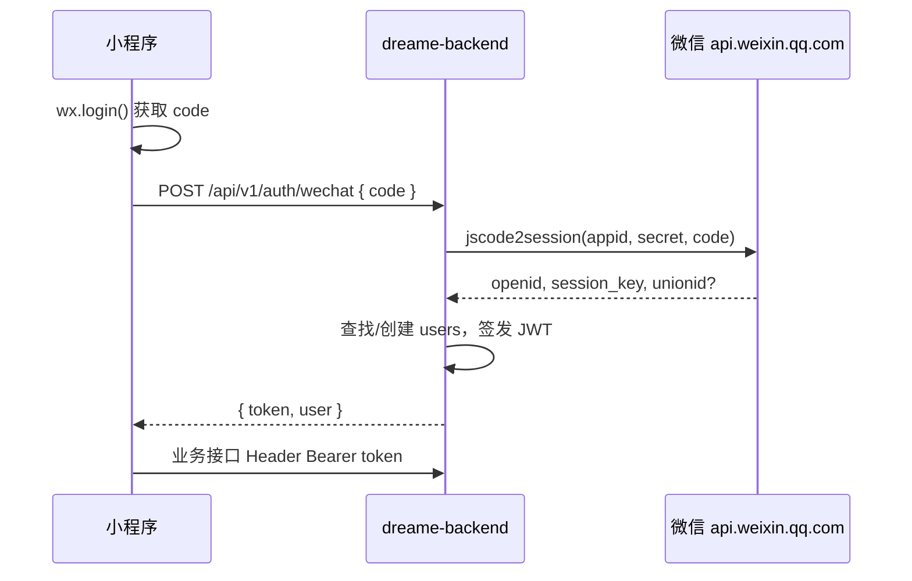

# Dreame 后端开发方案（v5 · 基于 dreame-pages_v5）

> 与原型目录 `dreame-pages_v5/`、`dreame-web-mini`、`dreame-web-support` 对齐。  
> **已确认决策**：① 一期即接微信授权；② 收货地址采用方案 B（下单入参 + 订单快照）；③ 业务 `code`：**200 成功 / 500 失败**。

---

## 一、目标与范围

### 1.1 业务目标

| 端 | 原型 | 核心能力 |
|----|------|----------|
| 小程序 | `mini_*` | 微信登录、商品、下单（带地址）、假支付、订单、退款申请 |
| 管理后台 | `admin_*` | 订单统计/列表/发货、退款审核、用户列表 |

### 1.2 一期范围

- **微信授权登录**（小程序 `code` → 后端换 `openid` → 签发 token）
- 商品只读、订单全流程（假支付）、发货、超时关单、未发货退款
- 收货地址：**不建地址簿**；下单时提交收件信息并写入订单快照

### 1.3 一期不做

- 微信支付统一下单、支付/退款回调
- 地址簿 CRUD、Banner/分类后台配置
- 已发货在线退款、物流轨迹查询、导出 Excel、多角色 RBAC

---

## 二、API 统一约定

### 2.1 响应信封

```json
{
  "code": 200,
  "message": "ok",
  "data": { }
}
```

| code | 含义 |
|------|------|
| **200** | 业务成功 |
| **500** | 业务失败（参数错误、状态不允许、未登录等） |

- HTTP 状态码：成功时一般为 **200**；未登录可用 **401**，无权限 **403**（`code` 仍为 500 或单独约定，实现时二选一并写进 OpenAPI）。
- `message`：给人看的简短说明；`data` 失败时可为 `null` 或附带 `errors` 字段。

### 2.2 与前端联调说明

当前 `dreame-web-mini`、`dreame-web-support` 的 `request.ts` 仍以 **`code === 0`** 判断成功。后端按本方案实现后，需**同步修改两端请求层**为 `code === 200`，并更新各 README 约定。

### 2.3 鉴权

| 端 | 方式 |
|----|------|
| 小程序 C 端 | `Authorization: Bearer <access_token>`（微信登录后下发） |
| 管理后台 | `Authorization: Bearer <admin_token>` 或环境变量固定 token（一期单管理员） |

---

## 三、微信授权（一期必做）

### 3.1 流程



### 3.2 接口

| 方法 | 路径 | 说明 |
|------|------|------|
| POST | `/api/v1/auth/wechat` | body: `{ "code": "..." }`；返回 `token`、`expiresIn`、`user`（id、nickname、avatarUrl 等） |
| GET | `/api/v1/auth/me` | 可选；校验 token，返回当前用户 |
| POST | `/api/v1/auth/logout` | 可选；一期可仅前端删 token |

### 3.3 数据与安全

**`users` 表（与微信相关）**：

| 字段 | 说明 |
|------|------|
| `openid` | 唯一索引，微信用户标识 |
| `unionid` | 可空 |
| `nickname` / `avatar_url` | 可由后续 `getUserProfile` 更新接口写入 |
| `phone` | 可空；一期若原型要展示手机号，需用户授权手机号组件，单独接口 |
| `session_key` | **加密存储**或仅存 Redis 短期缓存，勿明文日志 |
| `status` | `active` / `disabled` |
| `created_at` / `last_login_at` | |

**配置（`.env`）**：`WECHAT_APPID`、`WECHAT_SECRET`、`JWT_SECRET`、`JWT_EXPIRE_SECONDS`。

**实现要点**：

- `code` 一次性，失败返回 `code: 500` + 明确 message（如「登录码无效」）。
- 所有 C 端写操作与「我的订单」读操作必须带有效 JWT；商品列表/详情是否允许匿名由产品决定（建议：**商品可读匿名，订单必须登录**）。

### 3.4 小程序侧配合（非后端，但验收依赖）

- 启动或进入下单前调用登录；token 存 `uni.setStorageSync('token')`（已与 `request.ts` 一致）。
- 需在微信公众平台配置服务器域名（HTTPS）。

---

## 四、收货地址 — 方案 B

**不建 `user_addresses` 表**（一期无地址管理页）。

### 4.1 下单入参

`POST /api/v1/orders` body 示例：

```json
{
  "productId": "c1-station",
  "qty": 1,
  "remark": "请工作日配送",
  "receiver": {
    "name": "张三",
    "phone": "13800138888",
    "province": "上海市",
    "city": "上海市",
    "district": "浦东新区",
    "detail": "追觅科技大厦 12层"
  }
}
```

也可简化为单字段 `receiverAddress` 字符串（实现选一种，推荐结构化 + 服务端拼完整地址展示）。

### 4.2 订单快照

创建订单时把 `receiver_*` **冗余写入 `orders`**，历史订单不受用户后续修改影响。

| 字段 | 说明 |
|------|------|
| `receiver_name` | |
| `receiver_phone` | 列表/详情展示可脱敏 `138****8888` |
| `receiver_address` | 完整展示用拼接字符串 |

### 4.3 校验

- `name`、`phone`、`detail` 必填；手机号格式校验。
- 确认订单页（`mini_order_confirm`）提交前由小程序收集；无「选择地址」接口。

---

## 五、领域模型（摘要）

### 5.1 商品

3 款 SKU 与 `dreame-web-mini/src/constants/catalog.ts` 一致（种子数据迁移插入）。

### 5.2 订单状态机

```
pending_payment → pending_shipping（假支付）
pending_payment → closed（取消 / 24h 超时）
pending_shipping → shipped（管理端发货）
pending_shipping → refunded（退款审核通过）
shipped → completed（可定时自动完成）
```

### 5.3 退款

- 仅 `pending_shipping` 可申请；`shipped` 及之后返回 `code: 500`。
- 表：`refunds`、`refund_status_logs`；管理端审核通过 → 订单 `refunded`（假退款标记）。

### 5.4 金额

- 库内 **分**（整数）；接口层与前端约定统一用 **元** 或 **分**（实现前与前端定一种并在 OpenAPI 写明）。
- 金额一律服务端按商品现价计算。

---

## 六、API 清单（按模块）

前缀 `/api/v1`，成功均为 `code: 200`。

### 6.1 认证

| 方法 | 路径 | 登录要求 |
|------|------|----------|
| POST | `/auth/wechat` | 否 |
| GET | `/auth/me` | 是 |

### 6.2 商品

| 方法 | 路径 | 登录要求 |
|------|------|----------|
| GET | `/products` | 建议否 |
| GET | `/products/{id}` | 建议否 |

### 6.3 订单（C 端）

| 方法 | 路径 | 说明 |
|------|------|------|
| POST | `/orders` | 含 `receiver`，创建 `pending_payment` |
| POST | `/orders/{id}/pay-mock` | 假支付，幂等 |
| POST | `/orders/{id}/cancel` | 仅待付款 |
| GET | `/orders` | `?status=&page=&pageSize=` |
| GET | `/orders/{id}` | 详情含物流、退款信息 |

### 6.4 退款（C 端）

| 方法 | 路径 | 说明 |
|------|------|------|
| GET | `/orders/{id}/refund-eligibility` | 是否可申请 |
| POST | `/orders/{id}/refunds` | 提交申请 |
| GET | `/refunds/{id}` | 审核进度时间轴 |

### 6.5 管理端

| 方法 | 路径 | 说明 |
|------|------|------|
| GET | `/admin/dashboard` | 今日订单/销售额/待发货/新增用户 |
| GET | `/admin/orders` | 搜索、筛选、分页 |
| GET | `/admin/orders/{id}` | 详情 + 状态时间线 |
| POST | `/admin/orders/{id}/ship` | 物流公司 + 单号 |
| GET | `/admin/refunds` | 退款列表 |
| POST | `/admin/refunds/{id}/approve` | 通过 |
| POST | `/admin/refunds/{id}/reject` | 驳回 |
| GET | `/admin/users` | 用户列表（openid 衍生展示名、订单数、消费额） |
| PATCH | `/admin/users/{id}/status` | 禁用/启用 |

---

## 七、分阶段实施（修订）

| 阶段 | 内容 | 验收 |
|------|------|------|
| P0 | MySQL、Alembic、**响应封装 code 200/500**、CORS | 信封格式固定 |
| **P0.5** | **微信登录**、`users` 表、JWT 依赖注入 | 小程序带 token 可调 `/auth/me` |
| P1 | 商品表 + 种子 + GET 列表/详情 | 三条真实商品 |
| P2 | 下单（**方案 B 地址快照**） | 写库 `pending_payment`，金额服务端算 |
| P3 | 假支付幂等 | → `pending_shipping` |
| P4 | 管理端发货 | → `shipped` |
| P5 | 列表筛选 + 24h 超时关单 | Tab 与关闭单 |
| P6 | 取消、订单详情 | 对齐 `mini_order_detail` |
| P7 | 退款申请 + 管理端审核 | 对齐 `mini_refund_apply`、`admin_refund` |
| P8 | 管理端 dashboard、用户列表 | 对齐 `admin_orders`、`admin_users` |
| P9 | 联调：后端 + **两端 request 改为 code===200** | 端到端闭环 |

教学路线 [教学路线-假支付阶段.md](./教学路线-假支付阶段.md) 的 Day0–Day5 嵌入上表；**Day0 后增加「微信登录」里程碑**。

---

## 八、目录结构（实现参考）

```
app/
  core/response.py      # success(data) -> code 200; fail(msg) -> code 500
  core/security.py      # JWT、微信 jscode2session 客户端
  api/v1/endpoints/auth.py
  api/v1/endpoints/products.py
  api/v1/endpoints/orders.py
  api/v1/endpoints/refunds.py
  api/v1/endpoints/admin_*.py
  services/auth_service.py
  services/order_service.py
  models/user.py, order.py, product.py, refund.py
```

---

## 九、环境变量补充

```env
WECHAT_APPID=
WECHAT_SECRET=
JWT_SECRET=
JWT_EXPIRE_SECONDS=604800
ORDER_EXPIRE_HOURS=24
ADMIN_TOKEN=
```

---

## 十、风险与待确认

| 项 | 说明 |
|----|------|
| 手机号展示 | 原型有 `138****8888`；若不做 `getPhoneNumber`，仅下单时用户手填 |
| 商品匿名浏览 | 建议允许；下单/订单接口必须登录 |
| 前端 code 约定 | 必须与本文 **200/500** 同步改 mini + support |
| 微信测试 | 需真实小程序 AppID；开发可用微信开发者工具 + 后端内网穿透或体验版 |

---

**下一步口令**：「开始 Day1」或「先做微信登录」——按选定阶段在 `dreame-backend` 落地（届时再写代码）。
